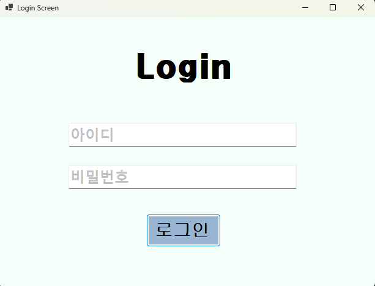
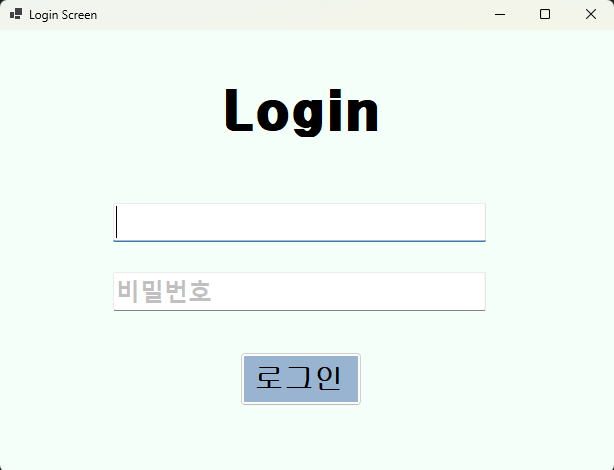
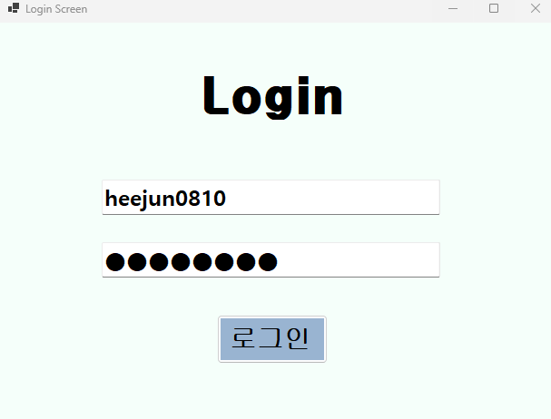
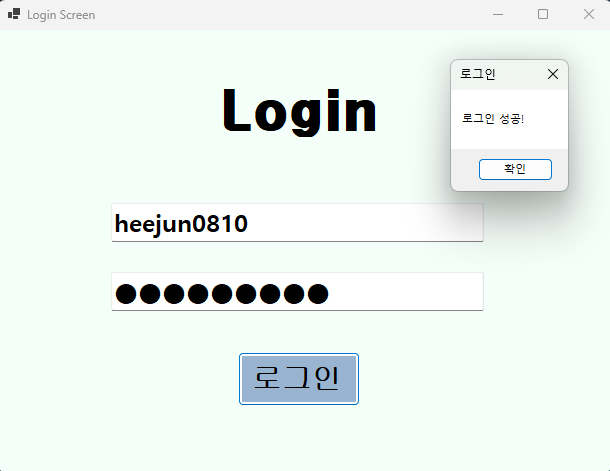
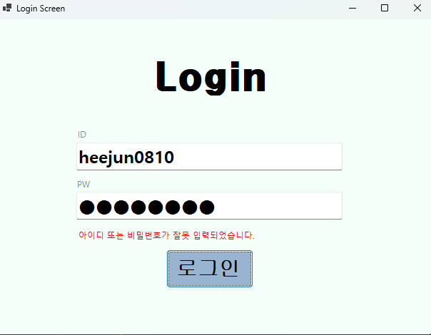
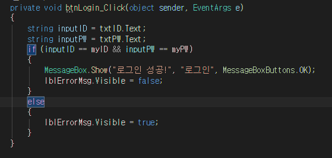
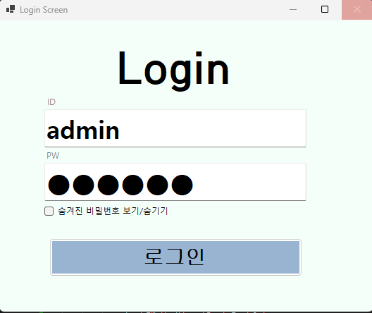
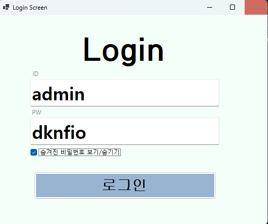

# # (C# 코딩 5주차) 로그인 화면 (Login Screen) 구현
***-- 22017004 컴퓨터 SW 강희준 --***

## 📑 개요: C# 프로그래밍 학습
한줄 소개 :* :
조건문과 이벤트 핸들링을 활용한 사용자 인증 시스템 및 UX 최적화 실습

### 🛠 사용한 플랫폼
- **Language & Framework:** C#, .NET Windows Forms
- **IDE:** Visual Studio 2022
- **Version Control:** GitHub

### 🏗 사용한 컨트롤
- **입력 및 출력:** Label(제목 및 에러 메시지), TextBox(아이디/패스워드 입력)
- **상호작용:** Button(로그인 실행)

### 💻 사용한 기술 및 개념 
- **비교 연산자(Comparison Operators):** `==` 연산자를 사용하여 사용자가 입력한 `inputID`, `inputPW` 변수와 프로그램에 미리 정의된 고유 계정 정보(`myID`, `myPW`)가 일치하는지 판별하는 로직을 구축.

- **논리 연산자(Logical Operators):** `&&` (AND) 연산자를 활용하여 아이디와 비밀번호라는 두 가지 독립적인 데이터가 모두 일치(`true`)할 때만 접근을 허용하는 다중 조건 검증 프로세스 설계.

- **제어문(Control Statements):** `if~else` 문을 통해 인증 성공 시에는 환영 메시지를, 실패 시에는 에러 라벨을 표시하는 프로그램의 분기 흐름을 설계함.

- **이벤트 기반 프로그래밍(Event-Driven):** `Enter`, `Leave` 이벤트를 통한 텍스트박스 플레이스홀더 구현 및 `KeyDown` 이벤트를 이용한 키보드 인터랙션 제어 기술을 습득함.

---

## 📸 과제 1: 기본 UI 배치 및 인증 기능 구현

|  |  |
||  |

**✅ 과제 내용**
- 로그인 화면 구성을 위한 주요 컨트롤(Label, TextBox, Button) 배치 및 디자인
- `if` 조건문과 논리 연산자를 이용한 아이디/비밀번호 일치 확인 로직 구현 
- 마우스 없이 키보드만으로 로그인이 가능하도록 엔터(Enter) 키 이벤트 핸들링 적용
- 포커스 이동(`Focus`) 및 버튼 강제 클릭(`PerformClick`) 구현

**💡 상세 구현 내용**
- `MainForm`에 `lblAppName`, `txtID`, `txtPW`, `btnLogin` 등을 배치하고 폼의 `BackColor`를 `Silver`으로 설정. 

- `txtPW`는 초기 보안을 위해`UseSystemPasswordChar` 속성을 제어하게 함. 

- 사용자가 로그인 버튼을 클릭하면 TextBox의 문자열을 변수에 할당하고, 이를 `myID`, `myPW` 상수 대조시켜 만듦.

- 인증 성공 시 `MessageBox.Show`로 성공 메시지를 띄우고, 실패 시에는 에러 메세지박스를 보이도록 설정.

- `txtID`와 `txtPW`의 `KeyDown` 이벤트에서 엔터키 입력을 감지하여 로그인 버튼의 `PerformClick()` 메서드를 호출, 키보드만으로도 로그인 프로세스가 원활히 진행되도록 구현.

**🔬 분석 및 학습 포인트**
- `txtID.Text` 속성을 통해 폼으로부터 데이터를 추출하고 이를 문자열 변수로 처리하는 과정을 수행함.
---

## 📸 과제 2: 가시성(Visible) 속성을 활용한 에러 표시

|  |  |
|:---:|:---:|

**✅ 과제 내용**
- 흐름을 끊는 메시지 박스 대신 화면 내 전용 라벨(`lblErrorMsg`)을 통한 에러 피드백 구현
	
- 상황에 따른 컨트롤의 `Visible` 속성 제어하여 상황에 맞는 알림 전달

**💡 상세 구현 내용**
- 인증 실패 시 시각적 경고를 주기 위해 빨간색 글씨의 `lblErrorMsg`를 배치.

- 폼 로드 시에는 보이지 않도록 설정한 후, `btnLogin_Click` 이벤트 내에서 인증 실패(`else` 구문) 시 `lblErrorMsg.Visible = true;` 코드가 실행되도록 구현. 

- 반대로 성공 시에는 라벨을 다시 숨겨 원래상태로 복구.

**🔬 분석 및 학습 포인트**
- `MessageBox`와 달리 `Visible` 속성 제어는 사용자가 추가적인 확인 클릭을 할 필요가 없어 서비스 연속성을 배움. 

- 속성값 하나를 코드로 제어함으로써 사용자 인터페이스가 어떻게 동적으로 반응하는지 깊이 있게 학습하였습니다.

---

## 📸 과제 3: UX 개선 

|  |  |
|:---:|:---:|

**✅ 과제 내용**
- 패스워드 숨기기 /보기 기능 구현 및 플레이스홀더 텍스트 적용

**💡 상세 구현 내용**
- checkBox(`chkShowPW`)를 추가하여 사용자가 패스워드 입력란의 내용을 숨기거나 보이도록 선택할 수 있게 함.
- chkShowPW의 `CheckedChanged` 이벤트에서 `txtPW.UseSystemPasswordChar` 속성을 토글하여 패스워드 가시성 제어.

## 💡 실습 소감 및 분석
- 간단한 로그인 화면 구현을 통해 C#의 기본적인 UI 컨트롤과 이벤트 핸들링, 조건문 사용법을 익힐 수 있었습니다.

- 사용자 경험(UX)을 개선하기 위한 다양한 방법을 시도하면서, 단순한 기능 구현에서 나아가 사용자 친화적인 인터페이스 설계의 중요성을 깨달았습니다.